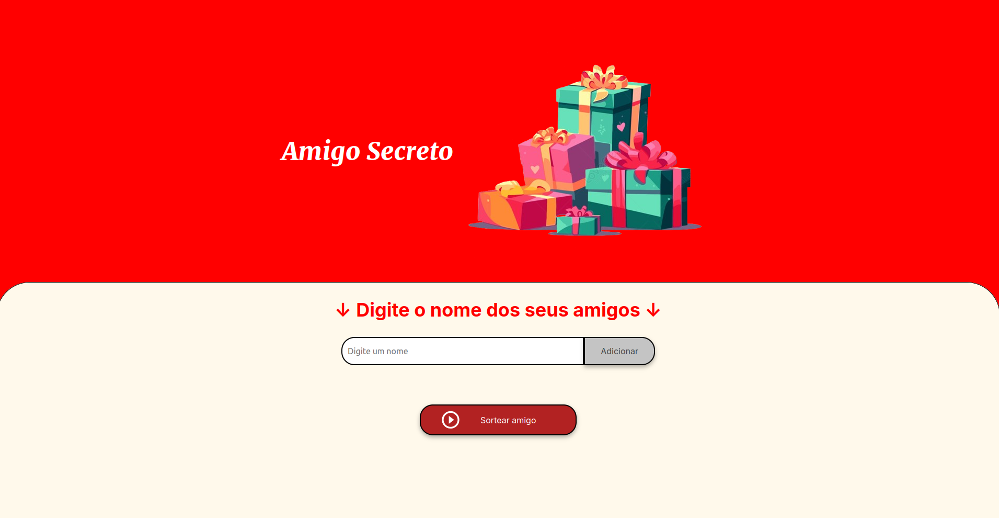

# 🎁 Amigo Secreto

Uma aplicação que permite aos usuários inserir nomes de amigos, em seguida, realiza um sorteio aleatório e determina quem é o "amigo secreto".

### ✨ Funcionalidades

- **Adicionar Amigos:** O usuário insere um nome no campo de texto e clica no botão "Adicionar".
- **Lista de Participantes:** Os nomes adicionados são exibidos em uma lista na tela.
- **Sorteio Aleatório:** Ao clicar no botão "Sortear Amigo", os pares de amigos secretos são formados de maneira aleatória.
- **Exibição Gradual:** Cada clique no botão "Sortear Amigo" revela um novo amigo sorteado até que todos sejam exibidos.

## 📷 Preview

## 🎮 Acesse o Jogo

🔗 **[Clique aqui para jogar!]()**  

*(O jogo pode passar por atualizações ao longo do tempo para melhorias.)*
